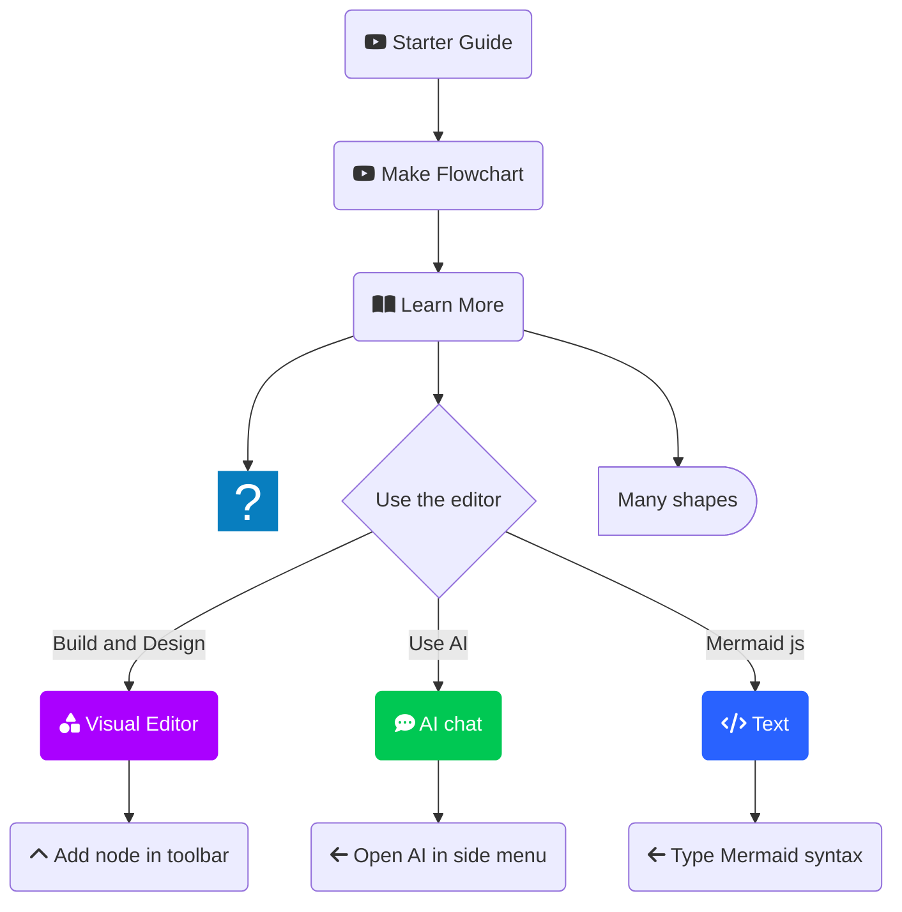

# Copilot Instructions for this Repository

This repository contains materials for an AI-Boosted Delivery demo using the Self-Service Proof of Insurance capability for a UK Retail insurance domain.

The goal is consistency:  
- consistent diagrams,  
- consistent specification files (PRD, agents.md),  
- consistent terminology and formatting.

Copilot must follow the rules below when generating code, diagrams, or documentation inside this repository.

---

# 1. Domain Context

Copilot should treat the domain as:

- UK Retail Insurance (Hiscox-like domain).
- A new capability called **Self-Service Proof of Insurance**.
- There is an existing **Policy System** (treated as a black box API).
- New component: **ProofOfInsuranceService**.
- Supporting components:
  - Customer Portal (SPA),
  - Document Generation Service,
  - Email Service,
  - Audit Log.

Use this terminology consistently.

---

# 2. Mermaid Diagrams — General Rules

## 2.1 Always output pure Mermaid code
No Markdown fences (` ``` `).  
No HTML.  
No commentary except `%% comment`.

## 2.2 Allowed diagram types
- `sequenceDiagram`
- `flowchart LR` (for C4-like container diagrams)

## 2.3 Node ID rules
- NO spaces in IDs.
- Use PascalCase or camelCase:  
  - `ProofService`, `PolicySystem`, `DocGen`, `EmailSvc`
- Labels must be in quotes:
  - `ProofService["Proof of Insurance Service"]`

## 2.4 Block content rules
Inside `<div class="mermaid">` must appear **only** Mermaid DSL.  
No HTML tags, no stray text.

## 2.5 Error avoidance rules
Copilot must NOT:
- insert tabs before Mermaid header,
- produce half-rendered diagrams,
- include Markdown code fences,
- leave trailing HTML inside the div.

Always validate that the first line of content inside `<div class="mermaid">` starts exactly with:

````

flowchart LR

```

or

```

sequenceDiagram

````

---

# 3. Flowchart (Architecture) Diagrams — Required Pattern

When producing architecture diagrams, follow this base structure:

```mermaid
flowchart TD
    %% Nodes
        A("fab:fa-youtube Starter Guide")
        B("fab:fa-youtube Make Flowchart")
        n1@{ icon: "fa:gem", pos: "b", h: 24}
        C("fa:fa-book-open Learn More")
        D{"Use the editor"}
        n2(Many shapes)@{ shape: delay}
        E(fa:fa-shapes Visual Editor)
        F("fa:fa-chevron-up Add node in toolbar")
        G("fa:fa-comment-dots AI chat")
        H("fa:fa-arrow-left Open AI in side menu")
        I("fa:fa-code Text")
        J(fa:fa-arrow-left Type Mermaid syntax)

    %% Edge connections between nodes
        A --> B --> C --> n1 & D & n2
        D -- Build and Design --> E --> F
        D -- Use AI --> G --> H
        D -- Mermaid js --> I --> J

    %% Individual node styling. Try the visual editor toolbar for easier styling!
        style E color:#FFFFFF, fill:#AA00FF, stroke:#AA00FF
        style G color:#FFFFFF, stroke:#00C853, fill:#00C853
        style I color:#FFFFFF, stroke:#2962FF, fill:#2962FF

    %% You can add notes with two "%" signs in a row!
````

Copilot should expand this pattern but keep:

* direction = LR,
* canonical components: Portal, ProofService, PolicySystem, DocGen, EmailSvc, Audit,
* consistent naming conventions.

---

# 4. Sequence Diagrams — Required Pattern

Use the following structure:

```mermaid
sequenceDiagram
    participant Customer
    participant Portal
    participant ProofService
    participant PolicyAPI
    participant DocGen
    participant EmailSvc
    participant Audit

    %% Interactions go here
```

Rules:

* `participant` lines always first.
* No spaces in participant names.
* Use `->>` for synchronous calls, `-->>` for responses.
* Show:

  * authentication,
  * policy retrieval,
  * document generation,
  * emailing,
  * audit logging.
* Include error cases on dedicated alt blocks ONLY if explicitly asked.

---

# 5. PRD Generation Rules

When Copilot generates or fills sections in `docs/prd-proof-of-insurance.md`:

* Always use clear English.
* No AI disclaimers.
* Use the following section structure:

```
1. Problem Statement
2. Business Goals
3. Scope / Out of Scope
4. Preconditions
5. High-Level Flow
6. Data Requirements
7. Acceptance Criteria
8. Error Conditions
9. Non-Functional Requirements
```

* Keep the PRD short, factual, and structured.
* Avoid repeating diagrams in the PRD. Reference them instead.

---

# 6. agents.md Generation Rules

When Copilot generates or fills `docs/agents-proof-of-insurance.md`:

* Follow this structure:

```
1. Overview
2. Agents
   2.1 Policy-Agent
   2.2 DocGen-Agent
   2.3 Email-Agent
3. Shared Constraints
4. Testing Expectations
5. Audit and Logging Rules
```

Agent definitions must include:

* responsibilities,
* input/output structures,
* dependencies,
* constraints,
* error handling expectations.

---

# 7. Code and Output Rules

Copilot must:

* Prefer minimal, readable output.
* Never invent unrelated context.
* Never generate incomplete diagrams unless explicitly instructed.
* Use the context from README.md and `/docs` directory.
* Assume the Policy System API exists and is stable.

---

# 8. Interaction Style

Copilot should:

* ask clarifying questions if the intent is ambiguous,
* avoid hallucinating API endpoints,
* base responses on provided context + standard insurance patterns,
* avoid jargon unless part of insurance domain vocabulary.

---

# 9. Forbidden Content

Copilot must NOT:

* output “as an AI model…” disclaimers,
* produce code fences unless generating full code blocks outside HTML,
* invent database schemas,
* create domain assumptions not grounded in the README.

---

# 10. Example of a valid architecture expansion

Below is a correct example of how Copilot may extend the architecture diagram:



DONT USE any special characters like brackets in connections.

---

These rules apply to all diagram generation and documentation creation in this repository.